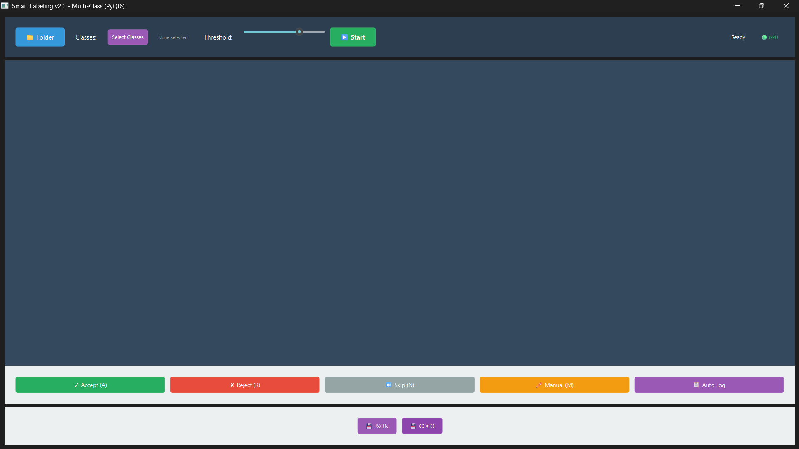
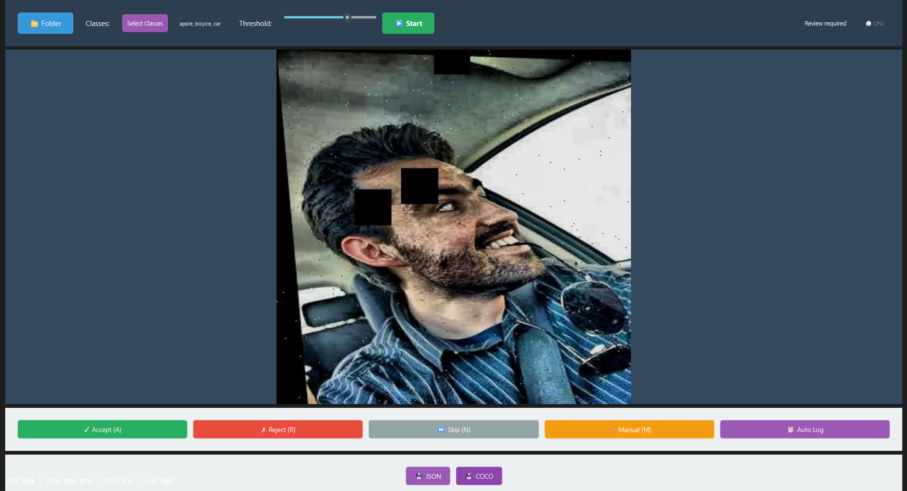

# LabelOps
**LabelOps – A local-first AI-assisted data labeling system with continual learning and background model training.**
<p align="center">
  
</p>

# LabelOps 

<p align="center">
  <strong>Stop labeling everything. Label what matters.</strong>
</p>

<p align="center">
  <a href="#-features">Features</a> •
  <a href="#-installation">Installation</a> •
  <a href="#-quick-start">Quick Start</a> •
  <a href="../../wiki">Wiki</a> •
  <a href="#-license">License</a>
</p>

---

## 🌟 What is this?

An intelligent active learning system that **reduces your labeling work by 60-80%**. It automatically identifies uncertain predictions where the model needs help, trains improved models in the background, and continuously gets better as you label.

**The Problem:** Labeling thousands of images is tedious and wasteful. Most images don't teach the model anything new.

**The Solution:** This system uses **entropy-based uncertainty sampling** to find the ~200 images that matter most, then auto-trains improved models while you work.

<p align="center">
  
</p>

---

## Features

### Smart Sample Selection
- **Entropy calculation** measures model uncertainty (0 = confident, 1 = confused)
- **Auto-queuing** for high-uncertainty images (entropy ≥ 0.6)
- Focus your time where it counts

### Background Training
- **Shadow models** train asynchronously using Ray
- **Zero interruption** to your labeling workflow
- **30 samples** trigger automatic training

### Catastrophic Forgetting Prevention
- **Replay buffer** maintains 200 high-quality historical samples
- **Class-balanced sampling** ensures all classes stay learned
- **Frozen backbone** preserves pre-trained features

### Production Ready
- **Model versioning** with atomic promotion
- **Rollback support** to any previous version
- **Validation checks** before model updates
- **Class mapping** auto-generated and maintained

---

## Installation

### One-Command Setup

```bash
git clone https://github.com/sairam-s0/LabelOps.git
cd LabelOps/src
python test_system.py
```

**That's it!** The test script automatically:
- ✅ Checks Python version (3.8+)
- ✅ Installs all dependencies
- ✅ Downloads base YOLO model
- ✅ Verifies CUDA availability
- ✅ Initializes Ray
- ✅ Tests all core modules
- ✅ Validates class mappings
- ✅ Runs sample inference

### Manual Installation (Optional)

```bash
# Clone repo
git clone https://github.com/sairam-s0/LabelOps.git
cd LabelOps\src

# Install dependencies
pip install -r requirements.txt

# Download base model
python -c "from ultralytics import YOLO; YOLO('yolov8n.pt')"

# Verify
python -c "import ray; from src.core import *; print('✓ Ready')"
```


**for more set-up instructions refer to [SETUP-GUID](./GUID.md)**


### Requirements

```txt
ultralytics>=8.0.0
ray>=2.0.0
numpy>=1.21.0
torch>=2.0.0
PyQt6>=6.4.0
opencv-python>=4.7.0
pyyaml>=6.0
```

---

## Quick Start

### 1. Run the GUI

```bash
python main.py
```

<p align="center">
  
</p>

### 2. Label High-Value Images

1. **Load images** → System runs inference
2. **Check entropy** → Red = uncertain, Green = confident
3. **Label red boxes** → Model is confused here
4. **Accept labels** → Auto-added to training queue

### 3. Auto-Training Kicks In

When you hit **30 labeled samples**:
- Shadow model trains in background (Ray)
- Progress shown in status bar
- Takes 5-10 minutes (GPU) or 20-30 minutes (CPU)

### 4. Promote the Model

When training completes:
- Click **"Promote Shadow Model"**
- New model becomes active
- Inference improves immediately

### 5. Repeat

The cycle continues - each round needs fewer labels as the model gets smarter.

---

## Architecture

```
┌──────────────────────────────────────────┐
│          Your Application                │
│    (GUI / CLI / Integration)             │
└───────────────┬──────────────────────────┘
                │
┌───────────────┴──────────────────────────┐
│         Core Components                  │
├──────────┬──────────┬────────────────────┤
│Inference │Data Mgr  │Model Mgr           │
│• predict │• labels  │• versions          │
│• entropy │• mapping │• promote/rollback  │
└──────────┴──────────┴────────────────────┘
                │
┌───────────────┴──────────────────────────┐
│      Training (Ray Distributed)          │
├──────────────┬───────────────────────────┤
│Shadow Trainer│Replay Buffer              │
│• async train │• balanced sampling        │
│• 50 epochs   │• forgetting prevention    │
└──────────────┴───────────────────────────┘
```

---

## Project Structure

```
labelops/
├── images/                     # Docs & UI screenshots
│   ├── Logo.svg
│   ├── gui_img.png
│   ├── normal_gui_img.png
│   ├── class_selection_img.png
│   ├── manual_marking_img.png
│   └── image_folder_img.png
│
├── src/
│   ├── core/                   # Core ML + training logic
│   │   ├── data_manager.py
│   │   ├── entropy.py
│   │   ├── inference.py
│   │   ├── model_manager.py
│   │   ├── replay_buffer.py
│   │   └── shadow_trainer.py
│   │
│   ├── features/               # UI features
│   │   └── manual.py
│   │
│   ├── models/                 # Model storage
│   │   ├── yolov8n.pt
│   │   ├── active_model.pt
│   │   └── versions/
│   │
│   ├── main.py                 # PyQt GUI entry
│   ├── test_system.py          # One-command system test
│   └── labels.json
|   └── requirements.txt
|   └── run_tests.bat      
│
├── README.md
├── GUID.md
├── LICENSE


```

---

## How It Works

### 1. Entropy Measures Uncertainty

```
High Confidence (Skip)          High Uncertainty (Label!)
Probs: [0.95, 0.03, 0.02]      Probs: [0.35, 0.33, 0.32]
Entropy: 0.15 ✓                Entropy: 0.98 ⚠️
```

### 2. Training Pipeline

```
30 new samples + 10 replay samples
        ↓
Shadow Trainer (Ray Actor)
        ↓
Fine-tune with frozen backbone (prevents forgetting)
        ↓
Validate → User approves → Promote to active
```

### 3. Continuous Improvement

Each training cycle requires fewer labels because the model gets better at knowing what it doesn't know.

---

## 📚 Documentation

Full documentation available in the [Wiki](../../wiki):
- **API Reference** - All classes and methods
- **Configuration Guide** - Tune for your use case
- **Troubleshooting** - Common issues solved
- **Advanced Usage** - Custom integrations
- **Performance Tips** - Optimize for speed

---

## Contributing

Contributions welcome! Please read [CONTRIBUTING.md](CONTRIBUTING.md) for guidelines.

1. Fork the repo
2. Create your feature branch (`git checkout -b feature/amazing`)
3. Commit changes (`git commit -m 'Add amazing feature'`)
4. Push to branch (`git push origin feature/amazing`)
5. Open a Pull Request

---

## License

This project is licensed under the MIT License - see [LICENSE](LICENSE) for details.

---

## Acknowledgments

- **Ultralytics** for YOLOv8
- **Ray Project** for distributed computing
- Active learning research community

---

<p align="center">
  <strong>Built with ❤️ for smarter annotation workflows</strong>
</p>

<p align="center">
  <a href="https://github.com/sairam-s0/LabelOps/issues">Report Bug</a> •
  <a href="https://github.com/sairam-s0/LabelOps/issues">Request Feature</a> •
  <a href="../../wiki">Documentation</a>
</p>

### Contribution Guidelines
1. Fork the repository
2. Create a feature branch (`git checkout -b feature/amazing-feature`)
3. Commit your changes (`git commit -m 'Add amazing feature'`)
4. Push to the branch (`git push origin feature/amazing-feature`)
5. Open a Pull Request

---

## License

This project is licensed under the MIT License - see the [LICENSE](LICENSE) file for details.

---

## Acknowledgments

- **Ultralytics** for YOLO implementation
- **Ray Project** for distributed computing framework
- Active Learning research community
- Contributors and early adopters

---

## 📞 Support

- 📧 Email: sairam.1242006@gmail.com
- 🐛 Issues: [GitHub Issues](https://github.com/sairam-s0/LabelOps/issues)
- 📖 Docs: [Full Documentation](https://docs.example.com)

---

## Roadmap

- [ ] Multi-GPU training support
- [ ] Web-based annotation interface
- [ ] Integration with Label Studio
- [ ] Automatic hyperparameter tuning
- [ ] Support for segmentation models
- [ ] Cloud training integration (AWS, GCP)
- [ ] Model ensemble support
- [ ] Active learning metrics dashboard

---

<p align="center">
  <strong>Made with ❤️ by the Active Learning Community</strong>
</p>